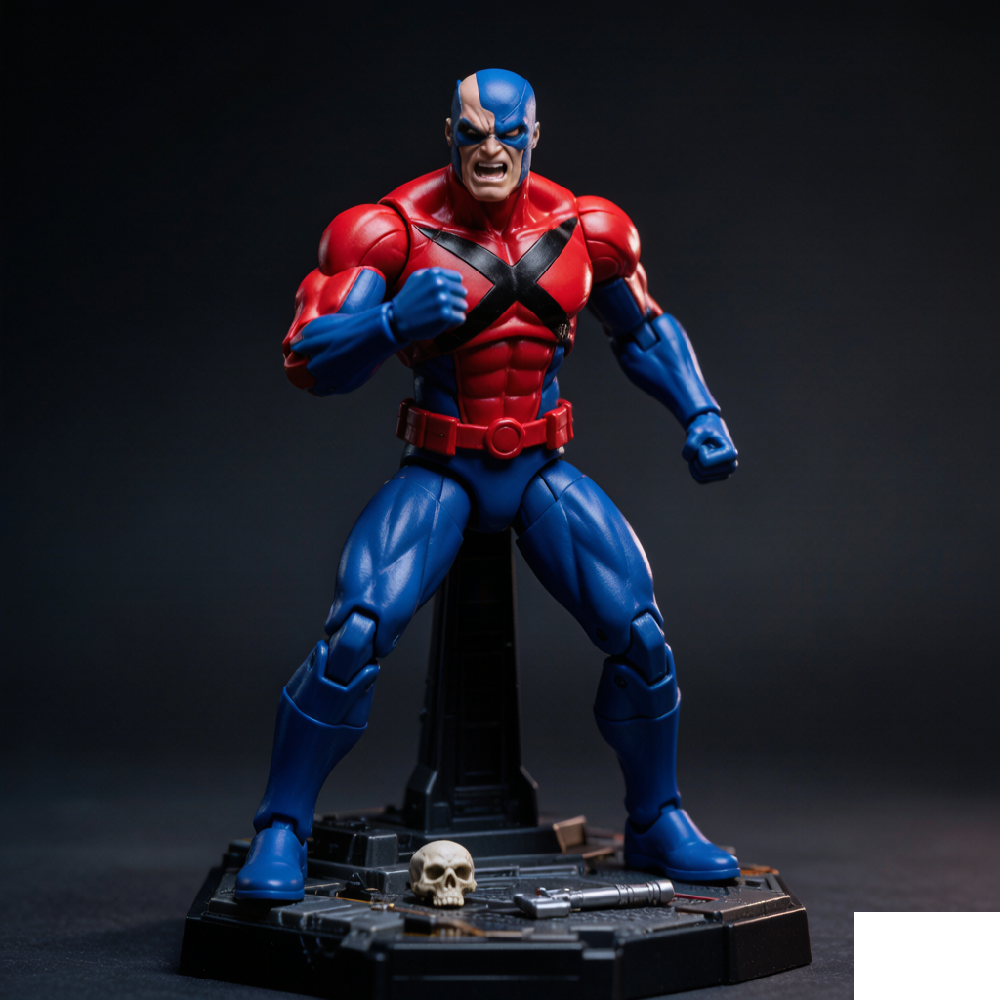
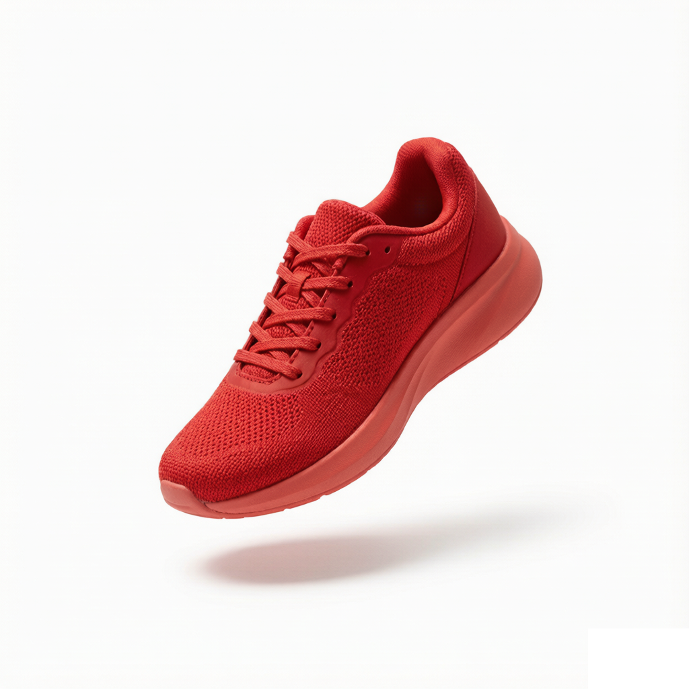
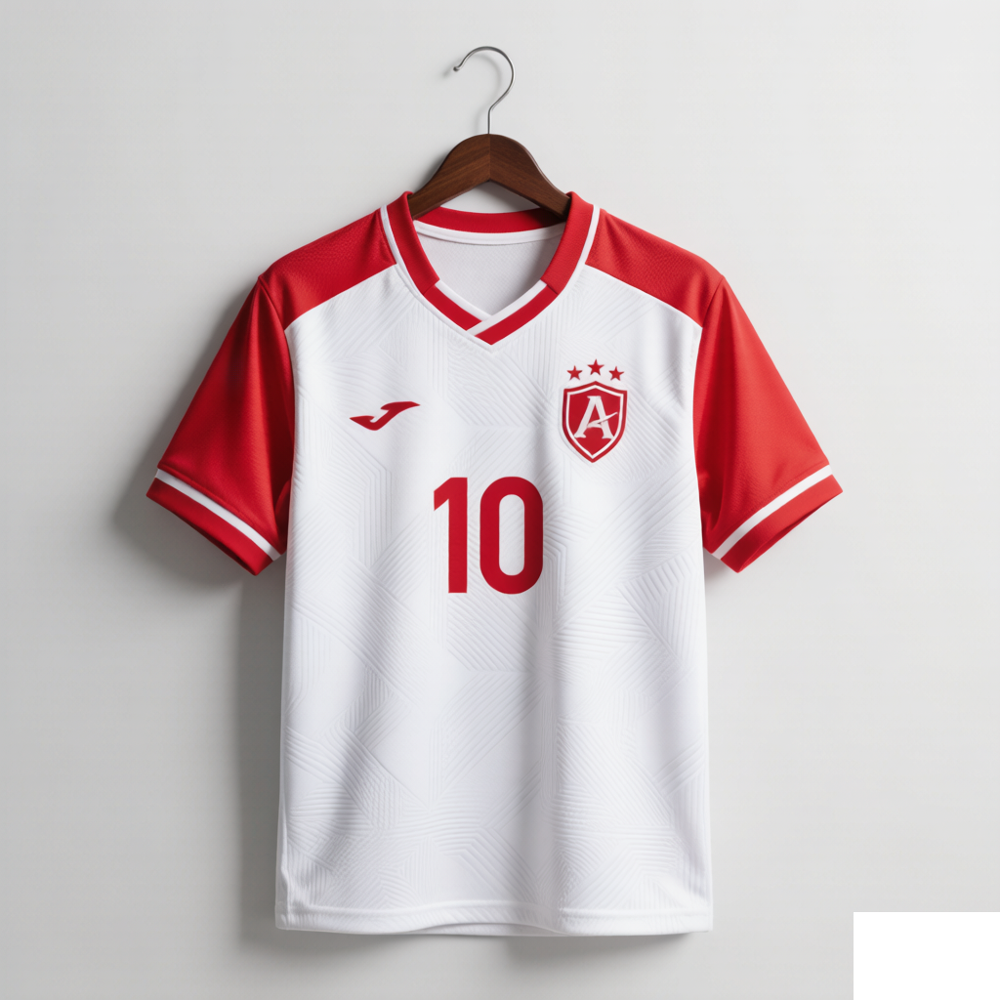

<div align="center">


# CubistAI

**Turn text into stunning images — in seconds.**

Free AI image generator with 9+ state-of-the-art models, 14 specialized creative tools,
and a credit-based SaaS engine — all in one web app.

**[🌐 Live at cubistai.org](https://cubistai.org)** · [Editor](https://cubistai.org/editor) · [Pricing](https://cubistai.org/pricing)


</div>

---

<!-- Showcase — 4 generated samples -->
<div align="center">

| | |
|:---:|:---:|
|  |  |
|  |  |

*All samples above were generated with CubistAI.*

</div>

## ✨ Why CubistAI

- **🎨 Multi-model editor** — GPT Image, Seedream, Nano Banana (Gemini Image), FLUX.2 Pro and more, behind a single prompt box. No separate accounts, no API juggling.
- **🧰 14 ready-made creative tools** — headshots, cartoon avatars, coloring pages, LinkedIn photos, background removal, watermark cleanup, poster & jersey design…
- **🖼 Up to 4K, multi-image output** — generate up to 4 images per task with aspect-ratio control and reference-image support.
- **🌍 Truly bilingual (plus)** — full UI in English, 简体中文, 日本語 and 繁體中文 with locale-aware routing.
- **💳 Complete SaaS engine** — credits (FIFO consumption + expiry), subscriptions, one-time passes, RBAC admin panel, invite codes, API keys — all built in.
- **🛡 Content safety built-in** — layered prompt moderation (keyword filter → SDK scan → configurable HTTP endpoint) before any generation.
- **⚡ Edge-ready** — deploys to Cloudflare Workers with D1 + R2. No servers to babysit.

## 🧰 Creative Tools

<div align="center">

| | | |
|:---:|:---:|:---:|
|  |  |  |
| **AI Headshot** | **Cartoon Avatar** | **Coloring Page** |
|  |  |  |
| **LinkedIn Photo** | **Profile Picture** | **Action Figure** |
|  |  |  |
| **Age Filter** | **Hair Color** | **Image Expander** |
|  |  |  |
| **Remove Background** | **Watermark Remover** | **AI Video** |

</div>

Plus a special **🏆 World Cup 2026 toolkit** — jersey design, match posters and fan coloring pages:

<div align="center">

| Jersey Designer | Match Poster | Fan Coloring |
|:---:|:---:|:---:|
|  |  |  |

</div>

## 💰 Pricing

| Plan | Price | Credits | Highlights |
| ---- | ----- | ------- | ---------- |
| **Free** | $0 | daily refresh | 4 image models, up to 1K |
| **Starter** | $7.90/mo | 1,100/mo | 6 models, up to 2K, permanent history |
| **Plus** ⭐ | $14.90/mo | 2,000/mo | 7 models, up to 4K, video models |
| **Pro** | $27.90/mo | 4,000/mo | all models, 4 img/task, credit rollover |
| **Lifetime** | one-time | up to 10M | pay once, use forever |

👉 Full details at [cubistai.org/pricing](https://cubistai.org/pricing)

## 🛠 Tech Stack

- **Framework** — [TanStack Start](https://tanstack.com/start) (Vite 8 + Nitro, React 19, TypeScript strict)
- **UI** — shadcn/ui v4 · Tailwind CSS 4 (oklch) · TanStack Query / Form / Table
- **Auth** — better-auth (email/password + OAuth) with RBAC
- **Database** — Drizzle ORM: SQLite / PostgreSQL / MySQL / Turso / Cloudflare D1
- **i18n** — Paraglide JS (compiled messages, locale-aware routing)
- **AI** — pluggable providers: Gemini (native), OpenRouter, Replicate
- **Payments** — Stripe / PayPal / Creem / Waffo (checkout, webhooks, credit atomicity)
- **Deploy** — Cloudflare Workers + D1 + R2, or any Node host (Docker included)

## 🚀 Quick Start

```bash
# 1. Install dependencies (pnpm required)
pnpm install

# 2. Configure environment
cp .env.example .env.development   # fill in AUTH_SECRET etc.

# 3. Create database tables
pnpm db:push

# 4. Initialize roles + admin user
pnpm rbac:init --admin-email=admin@example.com --admin-password=your-password

# 5. Start dev server
pnpm dev   # → http://localhost:3000
```

> Only `VITE_APP_URL`, `VITE_APP_NAME`, `DATABASE_PROVIDER`, `DATABASE_URL` and `AUTH_SECRET`
> are required to boot. AI generation works out of the box once a provider key is set
> in the admin panel (**Settings → AI**).

## ☁️ Deploy to Cloudflare Workers

```bash
cp wrangler.example.jsonc wrangler.jsonc   # set your D1 database id
pnpm cf:build
wrangler d1 execute <your-db> --remote --file=./drizzle/<migration>.sql
wrangler secret put AUTH_SECRET
wrangler secret put CONFIG_ENCRYPTION_KEY
wrangler deploy
```

Production image persistence requires R2/S3 (**Settings → Storage** in the admin panel).
Workers have no disk — see `wrangler.jsonc` bindings.

## 📂 Project Structure

```
src/
├── core/           # Infrastructure: db, auth, payment, storage, ai, i18n, content-safety
├── modules/        # Business logic: payment, credits, subscriptions, rbac, ai-tasks
├── routes/         # File-based routes (pages + REST API)
├── blocks/         # Page sections (hero, pricing, toolkit, faq…)
├── components/     # Shared UI (shadcn/ui primitives, data-table, form-field)
├── content/pages/  # MDX legal pages (ToS, Privacy, AUP)
└── config/         # Env config, DB schema, pricing, locales

messages/           # Translation source (en, zh, zh-tw, ja — flat dot-keyed)
```

## 🔗 Links

- **Website:** [https://cubistai.org](https://cubistai.org)
- **Editor:** [cubistai.org/editor](https://cubistai.org/editor)
- **Pricing:** [cubistai.org/pricing](https://cubistai.org/pricing)

## 📄 License

Copyright © CubistAI. This is proprietary software — see [LICENSE](./LICENSE).
Built on the [ShipAny Next](https://shipany.ai) SaaS template.

<div align="center">

**[ Start creating at cubistai.org → ](https://cubistai.org)**

</div>
